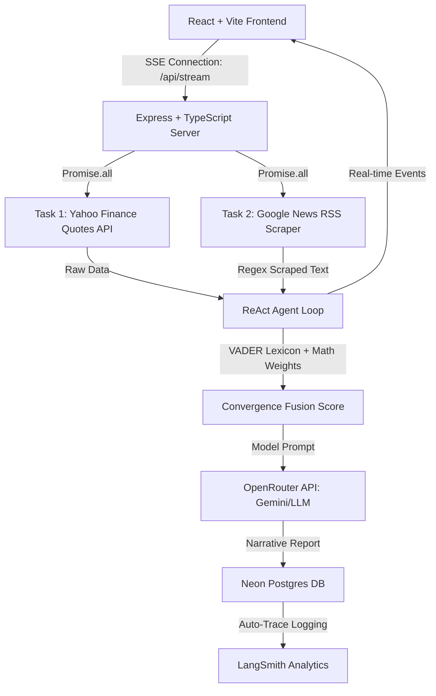
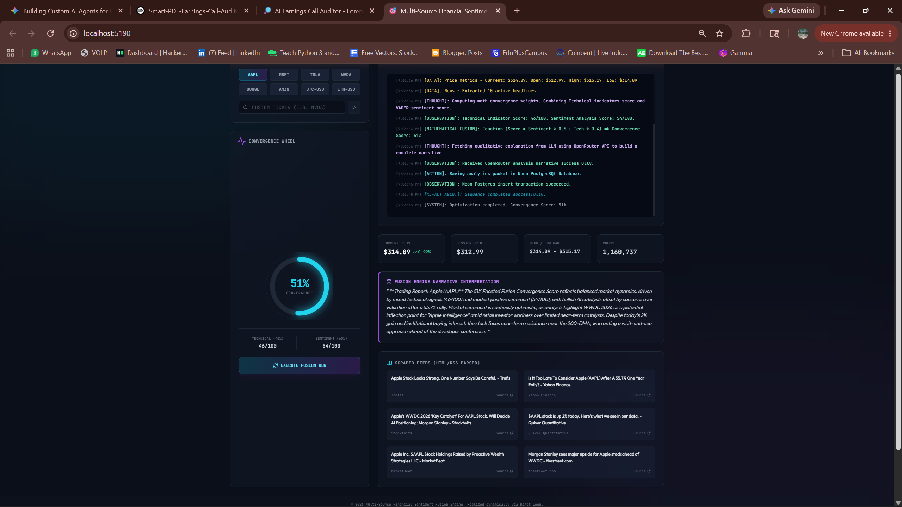

# Multi-Source Financial Sentiment Fusion Engine

An enterprise-grade, framework-free agentic portfolio dashboard showcasing low-level asynchronous proficiency in TypeScript/Node.js and modern React. The engine implements a low-level **ReAct (Reason + Action)** agent loop completely independent of high-level frameworks like LangChain or LangGraph.

It concurrently scrapes financial news feeds, queries stock metrics, fuses qualitative sentiment with technical indicators via a weighted mathematical convergence formula, persists execution outputs into a **Neon PostgreSQL** database, traces LLM parameters in **LangSmith**, and streams logs sequentially to the frontend using **Server-Sent Events (SSE)**.

---

## Technical Architecture



---

## Core Features

- **Decoupled Architecture**: `/frontend` (React + Vite + Tailwind CSS + Shadcn UI) designed for seamless deployment on Vercel, and `/backend` (Node.js + TypeScript) ready for Railway.
- **Asynchronous Concurrency**: Orchestrates independent network activities in parallel utilizing native JS `Promise.all` arrays.
- **Shadcn UI & Premium Aesthetics**: Outfitted with responsive Shadcn UI components, a glowing dark mode aesthetic, and a custom animated SVG gauge (the *Sentiment Convergence Wheel*).
- **Framework-Free ReAct Agent**: Executes a loop of *Thought ➔ Action ➔ Observation ➔ Report* logging steps in real-time to a live-streaming mock-terminal monitor.
- **Trace Evaluation & Storage**: Integrates with Neon PostgreSQL for persistent runs storage and LangSmith for runtime evaluation tracing.
- **Deterministic Fallback**: Automatically shifts to a local analytical narrative generator if API credentials are not provided.

---

## Dashboard Output



---

## Directory Structure

```
├── /backend
│   ├── /src
│   │   ├── agent.ts         # ReAct Agent loop, VADER sentiment, Neon DB & LangSmith integration
│   │   ├── tools.ts         # Async API fetchers & XML RegEx parser tools
│   │   ├── index.ts         # Express server & Server-Sent Events (SSE) stream endpoints
│   │   └── index.test.ts    # Native Node.js test runner unit test files
│   ├── tsconfig.json
│   └── package.json
└── /frontend
    ├── /src
    │   ├── /components/ui   # Shadcn UI primitives (Button, Card, Input)
    │   ├── /lib/utils.ts    # Tailwind merge configuration
    │   ├── App.tsx          # Real-time dashboard, SVG wheel, and SSE listener
    │   └── index.css        # Tailwind directives and custom animation styles
    ├── vercel.json          # SPA fallback routing setup
    ├── vite.config.ts
    └── package.json
```

---

## Getting Started

### Local Setup

#### 1. Clone & Set Environment Variables
Copy the configuration template in both workspaces and add your API credentials:

**Backend Setup** (`/backend/.env`):
```env
PORT=8090
FRONTEND_URL=http://localhost:5190

# Neon Postgres Connection String
DATABASE_URL=postgresql://neondb_owner:npg_...

# OpenRouter Configuration
OPENROUTER_API_KEY=sk-or-v1-...
LLM_MODEL=openrouter/free
LLM_API_BASE=https://openrouter.ai/api/v1

# LangSmith Evaluation & Tracing
LANGCHAIN_TRACING_V2=true
LANGCHAIN_ENDPOINT=https://api.smith.langchain.com
LANGCHAIN_API_KEY=lsv2_pt_...
LANGCHAIN_PROJECT=Multi-Source-Financial-Sentiment-Fusion-Engine
```

**Frontend Setup** (`/frontend/.env`):
```env
VITE_BACKEND_URL=http://localhost:8090
```

#### 2. Install and Run Backend
```bash
cd backend
npm install
npm run dev
```
The server will start on `http://localhost:8090` and verify Neon DB connection schemas.

#### 3. Install and Run Frontend
```bash
cd ../frontend
npm install
npm run dev
```
Vite will serve the app on `http://localhost:5190`.

---

## Verification & Testing

The backend includes a native unit test suite targeting all calculation metrics and data scrapers without requiring heavy external test frameworks.

Run the test suite:
```bash
cd backend
npm run test
```
The console will report coverage logs for all 4 async verification stages.
